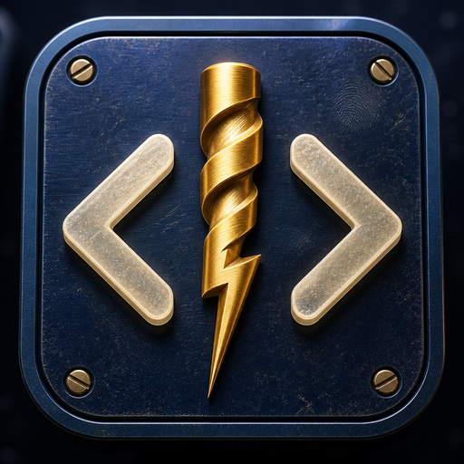

<p align="center">
  
</p>

# Dev Drill

Web development quiz app. Pick a level, track, and subject, then take a multiple choice quiz. Questions are generated by AI on the server, stored in MongoDB, and reused, including when daily AI tokens run out.

## Stack

- **Next.js** (App Router): UI + API / server actions
- **TypeScript**
- **Tailwind CSS**
- **MongoDB** via **Mongoose**
- **Zod**: validation

## Getting started

```bash
npm install
npm run dev
```

Open [http://localhost:3000](http://localhost:3000).

Fill in `.env` with MongoDB / AI keys when you add them.

## Scripts

| Command         | Description              |
| --------------- | ------------------------ |
| `npm run dev`   | Start development server |
| `npm run build` | Production build         |
| `npm start`     | Run production server    |
| `npm run lint`  | Lint                     |

## v1 scope (summary)

Junior / Mid / Senior / All × Frontend / Backend / Fullstack / DevOps × subjects. Fixed lengths (10 to 50) or Unlimited. Skip and rotate, grade on demand, stored explanations, quiz history, and personal best banners. Auth and public leaderboards come later.
